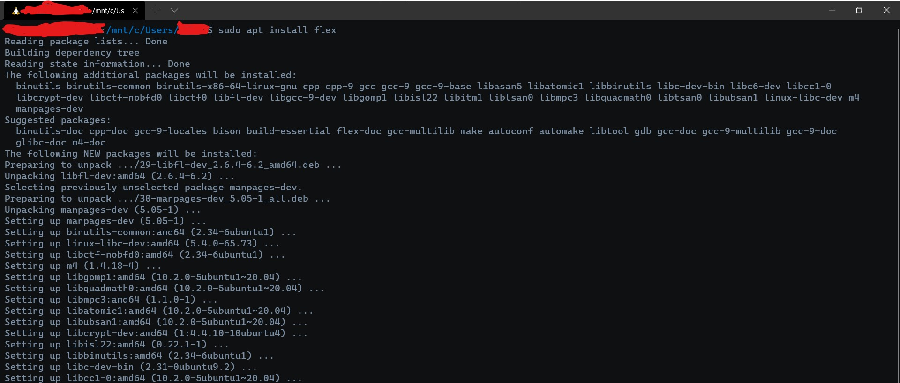
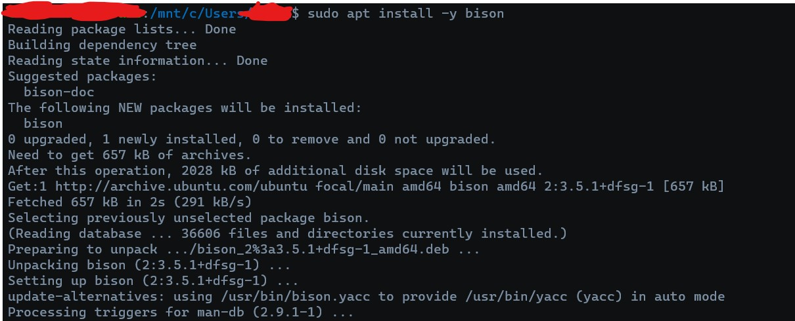
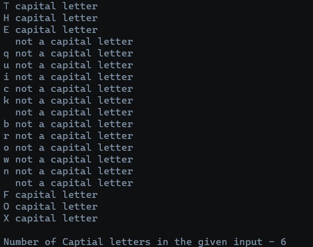
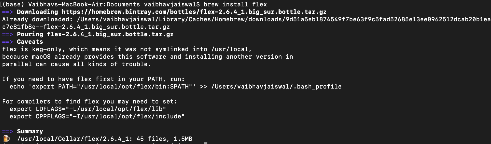
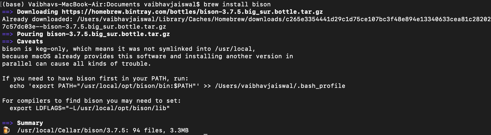
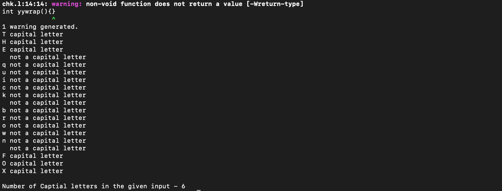

# compiler-construction-lab


<a href="https://github.com/theDrake1010"></a>
<a href="https://github.com/vaibhavjswl"></a>

This repository holds the code and instructions for the compiler construction lab (Spring 2021).


## Contents

- [Installation for Windows10 or Ubuntu](https://github.com/theDrake1010/compiler-construction-lab#installation-for-windows10-or-ubuntu)
- [Installation for Mac](https://github.com/theDrake1010/compiler-construction-lab#installation-for-mac)
- [Contribute](https://github.com/theDrake1010/compiler-construction-lab#contribute)
- [Important Notes](https://github.com/theDrake1010/compiler-construction-lab#important-notes)

## Installation for Windows10 or Ubuntu

Windows users need to install Ubuntu on (Windows Subsystem for Linux) WSL. 
If you have Ubuntu on your machine, you can skip the first step...


1. **Only for Windows 10 Users** : Installing [WSL](https://docs.microsoft.com/en-us/windows/wsl/about) and [Ubuntu](https://ubuntu.com/):
    
    This video demonstrates how to do this:
    
    [How to Install Ubuntu on Windows 10 (WSL)](https://www.youtube.com/watch?v=X-DHaQLrBi8) 

    You should be able to access an Ubuntu terminal after successfully completing this step.
    Watch the complete video to understand WSL Ubuntu's File Structure.

    PS: Please choose Ubuntu 20 for following the rest of instructions. Other distributions' steps may vary.

2. Open the Ubuntu terminal and type the following:

    a. Update/Upgrade your ubuntu packages:
    ```bash
    sudo apt update
    sudo apt upgrade
    ```
    Give it the password when prompted and type in "y" when asked to install.

    b. Installing Flex:
    ```bash
    sudo apt install flex
    ```
    

    c. Installing Bison:
    ```bash
    sudo apt install bison
    ```
    

3. Do a sanity check and test run of the software:
    a. First run a sanity check:
    ```bash
    which flex bison
    ```
    This should show you the location of installed packages usually:
    ```bash
    /usr/bin/flex
    /usr/bin/bison
    ```

    b. Run a Basic check program:
    On your terminal, copy or type the following:
    ```bash
    git clone https://github.com/theDrake1010/compiler-construction-lab.git
    cd compiler-construction-lab/checks
    ```
    
    Give the Execute permission to the run-check.sh file and run the file:
    ```bash
    chmod 744 ./run-check.sh
    ./run-check.sh
    ```
    
    The output should look like this: *If the checks directory is not modified*
    


## Installation For Mac

1. **Install [Homebrew](https://brew.sh/)** : 
    Homebrew is a package manager for MacOS (kind of like what apt is to linux).
    After Successfull installation move onto next step.

2. Open terminal :

    a. Update Brew using following commands:
    ```bash
    brew update 
    brew upgrade
    ```
    agree with "y" if prompred and it will update brew and all its packages to latest version

    b. Install Flex using following command:
    ```bash
    brew install flex
    ```
    

    c. Insall bison using following command : 
    ```bash
    brew install bison
    ```
    :
     

3. Do a sanity check and test run of the software:

    a. First run a sanity check:
    ```bash
    which flex bison
    ```
    This should show you the location of installed packages usually:
    ```bash
    /usr/bin/flex
    /usr/bin/bison
    ```

    b. Run a Basic check program:
    On your terminal, copy or type the following:
    ```bash
    git clone https://github.com/theDrake1010/compiler-construction-lab.git
    cd compiler-construction-lab/checks
    bash run-check.sh
    ```
    The output should look like this: *If the checks directory is not modified*
    


## Contribute

- For proposing changes to the source code:
    1. Fork this repo.
    2. Modify the repo on your fork.
    3. Open a Pull Request with meaningful comment stating changes.


- For reporting an issue:
    1. Go to the [Issues](https://github.com/theDrake1010/compiler-construction-lab/issues) Page
    2. Submit your issues with detailed report.


## Important Notes

When it comes to writing files for flex, bison and modern C compilers, there are a few changes that need to be done...

1. Use of "-lfl" instead of "-ly" and "-ll":
    The newer versions of GCC use the -lfl switch instead of -ly and -ll to link the necessary files.

2. Versions < 2.5.9 have a memory leak issue that needs to be manually solved by calling the `yylex_destroy()` function at end of `main()`.

3. Any functions used in the `*.y` files need to be globally declared to avoid warnings. This includes `void yyerror(char*)` and `int yylex(void)` most importantly.

4. `void yyerror(char*)` needs to be defined by the user as an aux function inside the `*.y` file. 

More details can be obtained here: [Converting from lex & yacc to flex & bison](https://www.di-mgt.com.au/converting_from_lex_and_yacc.html)

