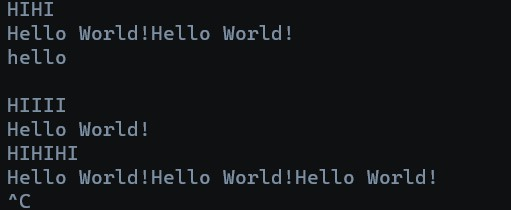

# Lab 1

Take input from console and print hello world everytime "HI" is input on the console.

## Contents:
- [How to make a Lex file](https://github.com/theDrake1010/compiler-construction-lab/tree/main/lab-1#how-to-make-a-lex-file)

- [How to run the lex file](https://github.com/theDrake1010/compiler-construction-lab/tree/main/lab-1#how-to-run-the-lex-file)

- [Output](https://github.com/theDrake1010/compiler-construction-lab/tree/main/lab-1#output)


## How to make a Lex file?
"
1. Create the lex file through your terminal and open it in an editor(You can use any editor. Here its shown for "nano"):
```bash
touch hello-world.l
nano hello-world.l
```
This should open a blank text editor where you can type and save stuff. On the bottom you will see commands and what they do("^" is the control button)

Eg: Ctrl+X (^X) will exit the nano editor.

2. There are no global variables/definitions. 

3. Two rules:
    - Print "Hello World" everytime the literal "HI" is seen.
    - Do nothing for anything else.

4. Finally, create a main function that calls `yylex()` and returns 0.

You can refer the file [hello-world.l](https://github.com/theDrake1010/compiler-construction-lab/blob/main/lab-1/hello-world.l) for more understanding.


## How to run the lex file?

1. Ensure you are in the directory with lex file:

```bash
cd <directory path>
```

2. Use flex to create the C file:

```bash
flex hello-world.l
```

3. Use GCC or CC to compile the C file "lex.yy.c":

```bash
cc lex.yy.c -ll
```

*Note: If "-ll" flag isnt used, you will receive an error since `yywrap()` is not defined in the current lex file.*


4. Run the output file "a.out":
```bash
./a.out
```

5. Type "HI" and press Enter :)

## Output:

The result should look something like this:


