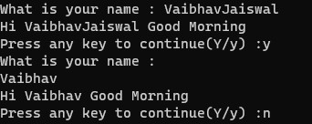

# LAB 2 - Print the Entered Name

## RUN THE CODE via 

1.  Use lex to create C file via : 

    ```bash
    flex print_name.l
    ```

2.  Use GCC to compile C file via :
    ```bash
    gcc lex.yy.c 
    ```

3. Run file with temp.txt as command line argument :
    ```bash
    ./a.out 
    ```

## Output


