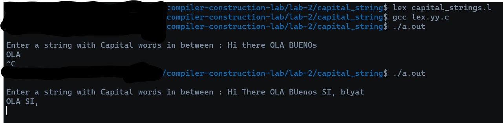

# Template README <Replace with Name>

*This is a template README auto-added on push or pull request. Please complete the README or open an issue for the same.*
<Add a short description here>

## How to Run?

<Add any text instructions here>

```bash
<Add bash cmds here>
```


## Output

<Add the output image in the holder below: (view raw)>


