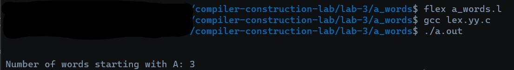

# a_words

<add description here>

## RUN THE CODE via 
1.  Use lex to create C file via : 
    ```bash
    flex <FILENAME>
    ```

2.  Use GCC to compile C file via :
    ```bash
    gcc lex.yy.c 
    ```

3. Run file as command line argument :
    ```bash
    ./a.out <add any args here if needed>
    ```

## Output



