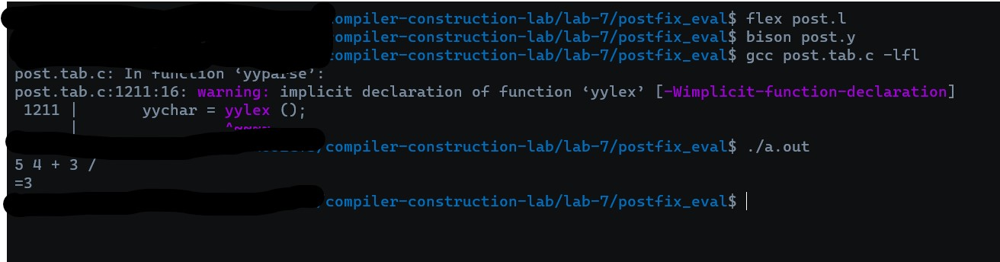

# Postfix Evaluation

Create a parser that reads simple postfix expressions and evaluates them.

## How to run:

```sh
flex post.l
bison post.y
gcc post.tab.c -lfl
./a.out
```

## Output:



---
## Notes:

- There are a few changes which had to be made to make the code run.
- The functions had to be declared in global scope to ensure they can be used inside actions.
- An Additional "yyerror()" function had to added as it was not getting picked up in compilation phase.
- The way to compile the code has changed. **The earlier switches are deprecated**:
    - Before:
        ```sh
            gcc post.tab.c -ll -ly
        ```
    - After:
        ```sh
            gcc post.tab.c -lfl
        ```
    - The "-ll -ly" switches tells the compiler to link external libraries. Earlier, there were two libraries to link(lex and yacc). This is now deprecated and the "-lfl" switch takes its place.
- The warning issue is known and I am searching for a way to remove it(**For now, it can be safely ignored**). PS: I know I can hide the warning with switches but I am speaking of removing the problem and not hiding it.
- With that said, this might be difficult as the warning directly points to code inside the library.

