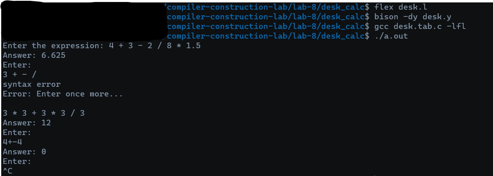

# desk_calc

<add description here>

## RUN THE CODE via 
1.  Use lex to create C file via : 
    ```bash
    flex desk.l
    ```

2. Use bison to create y.tab.c:
    ```bash
    bison -dy desk.y
    ```

3.  Use GCC to compile C file/s via :
    ```bash
    gcc desk.tab.c -lfl
    ```

4. Run file as command line argument :
    ```bash
    ./a.out
    ```

## Output



