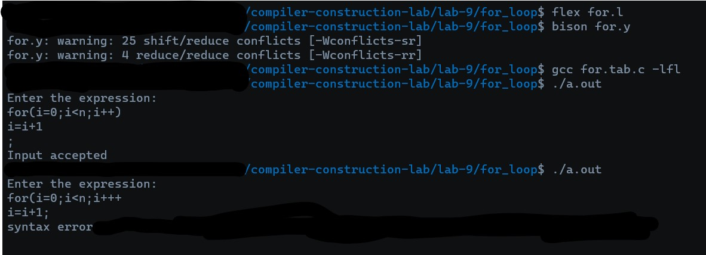

# for_loop

Create a parser that parses a "C-style" for loop


## RUN THE CODE via 
1.  Use lex to create C file via : 
    ```bash
    flex for.l
    ```

2. Use bison to create for.tab.c:
    ```bash
    bison -dy for.y
    ```

3.  Use GCC to compile C file/s via :
    ```bash
    gcc for.tab.c -lfl
    ```

4. Run file as command line argument :
    ```bash
    ./a.out
    ```

## Output



## Notes

1. The Parser does generate some Shift-Reduce and Reduce-Reduce Warnings which can be ignored for now.
